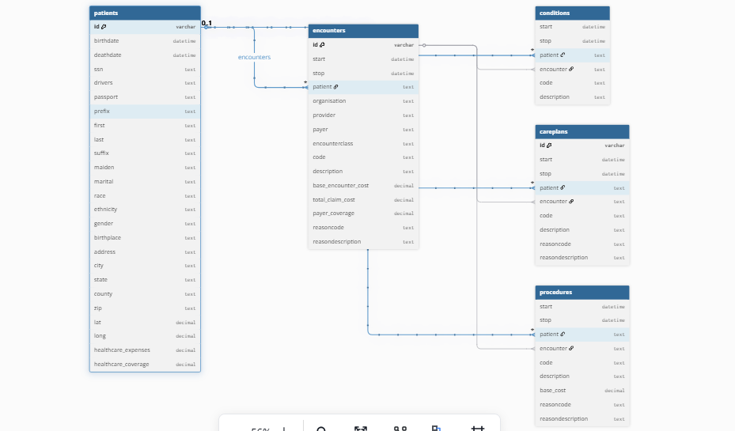

Table patients {
  id varchar [primary key]
  birthdate datetime
  deathdate datetime
  ssn text
  drivers text
  passport text
  prefix text
  first text
  last text
  suffix text
  maiden text
  marital text
  race text
  ethnicity text
  gender text
  birthplace text
  address text
  city text
  state text
  county text
  zip text
  lat decimal
  long decimal
  healthcare_expenses decimal
  healthcare_coverage decimal
}

Table encounters {
  id varchar [primary key]
  start datetime
  stop datetime
  patient text
  organisation text
  provider text
  payer text
  encounterclass text
  code text
  description text
  base_encounter_cost decimal
  total_claim_cost decimal
  payer_coverage decimal
  reasoncode text
  reasondescription text
}

Table conditions {
  start datetime
  stop datetime
  patient text
  encounter text
  code text
  description text
}

Table careplans {
  id varchar [primary key]
  start datetime
  stop datetime
  patient text
  encounter text
  code text
  description text
  reasoncode text
  reasondescription text
}

Table procedures {
  start datetime
  stop datetime
  patient text
  encounter text
  code text
  description text
  base_cost decimal
  reasoncode text
  reasondescription text
}

Ref encounters: encounters.patient > patients.id // many-to-one

Ref conditions: conditions.patient > patients.id // many-to-one

Ref careplans: careplans.patient > patients.id // many-to-one

Ref procedures: procedures.patient > patients.id

Ref conditions: conditions.encounter > encounters.id

Ref careplans: careplans.encounter > encounters.id

Ref procedures: procedures.encounter > encounters.id

